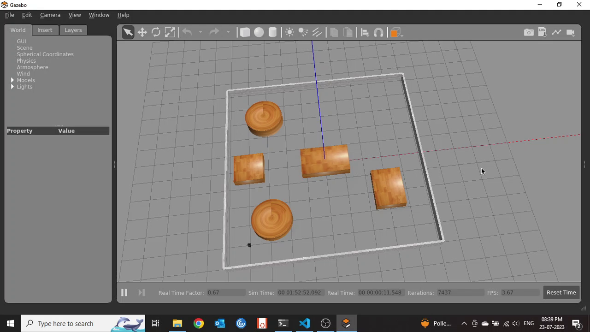

# Path Planning a Turtlebot using A* Algorithm in ROS

The project goal was two pronged.
1. Design an A* algorithm for the prurpose of Path Planning of non-holonomic differential drive mobile robot (designed after a Turtlebot3 Burger) and generate a path from start to goal in such a way to avoid all obstacles.
2. Use the path generated to move a Turtlebot3 Burger model in Gazebo with the simulated environment of the math to traverse the robot from start to goal. 

## Defining the map
We use the concepts of Algebraic Half planes to define the free space and the obstacles. And then design the map using Gazebo and create a world file.<br>


## Exploring the Map
Use the action set generated to derieve new child nodes, select the best child node and keep adding them to the set of visited nodes until you reach the goal nodes while following the algorithm.

## Optimal path in Gazebo
After we explore the entire map, we use backtracking to find the path with the least cost. <br> The operation of the algorithm is shown below. <br>


## Dependencies and libraries
1. Robot Operating System 1 - Noetic
2. ROS Noetic dependencies
    * python3-rosdep python3-rosinstall python3-rosinstall-generator python3-wstool build-essential
    * ros-noetic-gazebo-ros-pkgs ros-noetic-gazebo-ros-control
    * ros-noetic-teleop-twist-keyboard ros-noetic-rqt* ros-noetic-rviz \
    ros-noetic-gmapping ros-noetic-navigation
    * ros-noetic-turtlebot3-msgs
    * ros-noetic-turtlebot3
3. Python 3.8 minimum
4. Matplotlib
5. Deque
6. Numpy

## Usage
* Clone the repo to your local machine
```
git clone https://github.com/HemanthJoseph/Path-Planning-a-Turtlebot-using-A-Star-Algorithm-in-ROS.git
```
* Copy my_package folder to your catkin_ws/src in ROS 1 with your other ROS packages
Use this link to create a *[ROS Catkin workspace](http://wiki.ros.org/catkin/Tutorials/create_a_workspace)*
* Make the python file  (our node) as an executable
```
cd catkin_ws/src/my_package/scripts
chmod +x  my_publisher.py
```
* Navigate to your workspace
```
cd catkin_ws
```
* Build the ROS1 package
```
catkin_make my_package
```
* Open a new terminal window and launch the Gazebo in the World
```
source devel/setup.bash
roslaunch my_package world_launch.launch
```
* Open a new terminal window and run the node to make Gazebo run
```
source devel/setup.bash
rosrun my_package my_publisher5.py
```
* In the command line enter the inputs values for start and goal coordinates and ensure that the points don't fall in the obstacles as the program will keep prompting you to enter points that aren't in the obstacle space.

Sit back and watch the robot traverse the path in Gazebo.